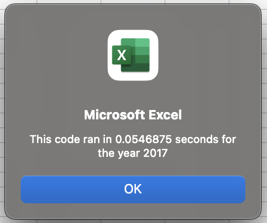
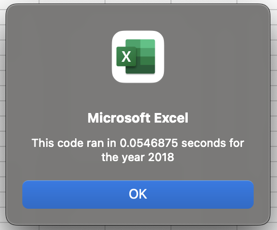

# VBA Refactoring Analysis

## Purpose
The purpose of this project is to compare the differences in run times for a VBA script and a refactored version of that script.

## AllStocksAnalysis() Code

### Description
`AllStocksAnalysis()` looks at data contained in two worksheets in [VBA_Challenge.xlsm](VBA_Challenge.xlsm). There is data for 12 "green stocks" for two years: 2017 and 2018. When the script is run it will list for each stock the total Daily Volume traded for the year and the yearly return expressed as a percentage.

### AllStocksAnalysis() Code
Generally, the scipt runs by having an array of all the stock tickers that we wish to analyze. We loop over the ticker array and within that, we loop over all of the stock data and extract the information that we need on that stock.

The following is the original code. The whole script will not be listed here, only those sections that are of primary interest to the refactoring. The lines enclosing each `for` loop are added for emphasis.

```
'4) Loop through tickers
 ---For i = 0 To 11
|   
|       ticker = tickers(i)
|       
|       totalVolume = 0
|       
|       Worksheets(yearValue).Activate
|   
|       '5) loop through rows in the data
|    ---For j = 2 To RowCount
|   |       
|   |       '5a) Get total volume for current ticker
|   |       If Cells(j, 1).Value = ticker Then
|   |       
|   |           totalVolume = totalVolume + Cells(j, 8).Value
|   |       
|   |       End If
|   |       
|   |       '5b) get starting price for current ticker
|   |       If Cells(j, 1).Value = ticker And Cells(j - 1, 1).Value <> ticker Then
|   |       
|   |           startingPrice = Cells(j, 6).Value
|   |       
|   |       End If
|   |       
|   |       '5c) get ending price for current ticker
|   |       If Cells(j, 1).Value = ticker And Cells(j + 1, 1).Value <> ticker Then
|   |       
|   |           endingPrice = Cells(j, 6).Value
|   |       
|   |       End If
|   |   
|    ---Next j
|       
|       'Activate the output worksheet
|       Worksheets("All Stocks Analysis").Activate
|       
|       'Output the data for the current ticker
|       Cells(4 + i, 1).Value = ticker
|       Cells(4 + i, 2).Value = totalVolume
|       Cells(4 + i, 3).Value = endingPrice / startingPrice - 1
|   
 ---Next i
```

As can be seen we have a `for` loop inside of a `for` loop. This is done for each ticker. So if we were only to add tickers on which to get data (assuming we werern't already getting data on every tracker in the dataset) or if we were adding data to the dataset (without also tracking its ticker) the runtime of this script would grow linearly with the tickers or data. However, if we begin to add new data *and* the new tickers to the array for tracking, we would expect this runtime to grow *exponentially*.

## AllstocksAnalysisRefactored() Code
Wanting to avoid an exponentially increasing runtime, we have refactored the code so that an increase in data will only be a linear increase in runtime.

The following code is the refactored portion from above. Again the lines enclosing the `for` loop are added for emphasis.

```
'2b) Loop over all the rows in the spreadsheet.
 ---For i = 2 To RowCount
|   
|       '3a) Increase volume for current ticker
|       tickerVolume(tickerIndex) = tickerVolume(tickerIndex) + Cells(i, 8).Value
|       
|       '3b) Check if the current row is the first row with the selected tickerIndex.
|       If Cells(i, 1) <> Cells(i - 1, 1) Then
|           
|           tickerStartingPrices(tickerIndex) = Cells(i, 6).Value
|           
|       End If
|       
|       '3c) check if the current row is the last row with the selected ticker
|       'If the next row’s ticker doesn’t match, increase the tickerIndex.
|       If Cells(i, 1) <> Cells(i + 1, 1) Then
|           
|           tickerEndingPrices(tickerIndex) = Cells(i, 6).Value
|           tickerIndex = tickerIndex + 1
|           
|       End If
|  
 ---Next i
```

### Refactoring
As can be seen, there is now only a single `for` loop, i.e. we only loop over the rows of data a single time, instead of once for every ticker. This required us to initialize several tracker variables above this new loop:

```
    tickerIndex = 0
    Dim tickerVolume(12) As Long
    Dim tickerStartingPrices(12) As Single
    Dim tickerEndingPrices(12) As Single
```

We did this so that we can increment `tickerIndex` as soon as we reach a new ticker in the dataset. In doing so, we can access the above arrays according `tickerIndex` and arrive at the same information as the original code. 

### Expectations of Refactoring
Because we are reducing the number of loops over the dataset from 12 (the number of tickers) to 1, we expect our runtime to drop dramatically. Now this doesn't mean that expect our refactored runtime to be 1/12 of the original runtime. There are many other operations such as variables declarations and formatting that remain the same between the original and refactored code.

## Results

### 2017 Data
The runtime for the original code on the 2017 dataset is approximately 287ms. The following shows the runtime for the 2017 dataset with the refactored code is approximately 55ms. This is approximatey 20% of the original runtime. 


### 2018 Data
The runtime for the original code on the 2018 dataset is approximately 285ms. The following shows the runtime for the 2018 dataset with the refactored code is approximately 55ms. This is again approximately 20% of the original runtime.


## Advantages and Disadvantages of Refactoring

### General Considerations

#### --Advantages--

#### --Disadvantages--

### Considerations of Refactoring above VBA Code

#### --Original Code--

##### --Advantages--

##### --Disadvantages--
Disadvantages to both the original and refactored code to be discussed below.

#### --Refactored Code--

##### --Advantages--
Per the above analysis, the most obvious advantage of the refactored code is the improved speed. ~300ms to ~50ms may not seem like a signifcant practical improvement - and for 3012 rows of data, it's not. However, we should consider that this script could be run on data with an arbitrary number of rows. And as the number of rows increases, we would expect to see the runtime for the original code to grow considerably more quickly than the runtime of the refactored code.

##### --Disadvantages--
Disadvantages to this code (as well as to the original code) are that the stock tickers must be known, and they must be sequential.